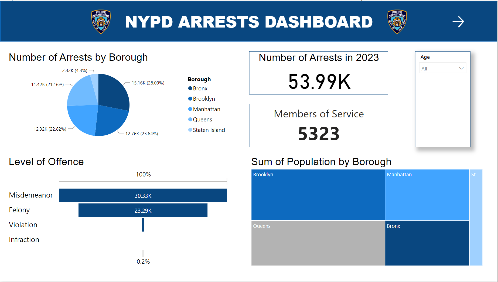
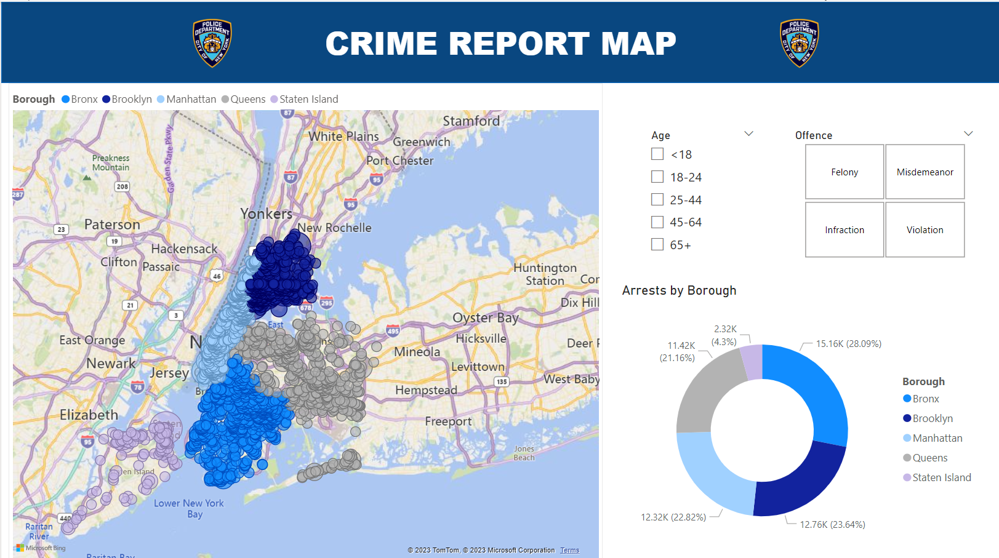
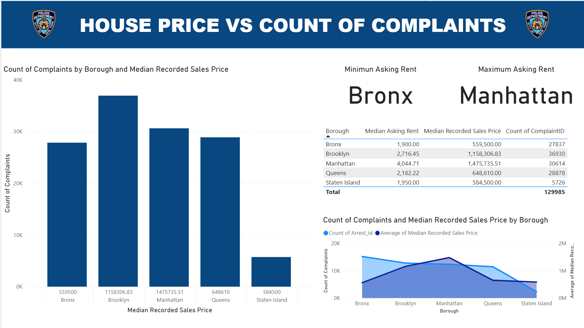
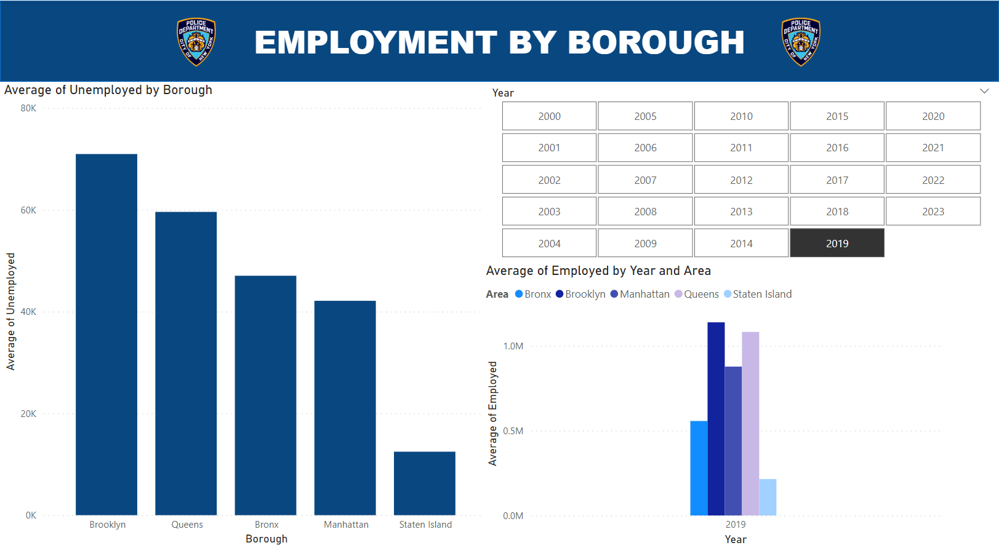

# EDA_NYPD

## Índice

1. [Descripción](#descripcion-del-proyecto)
2. [Objetivo](#objetivo)
3. [Dashboard Resumen](#)
4. [Análisis](#)
5. [Conclusiones](#conclusion)

## 1.  Descripción del proyecto

Este proyecto tiene como objetivo analizar y reconocer patrones y tendencias en la actividad de aplicación de la ley por parte de la policía de la ciudad de Nueva York, representada en estadísticas de arrestos realizados por el NYPD.

### 2. Objetivo

### 3. Dashboard resumen 

Brooklyn tiene el mayor número de arrestos entre los cinco distritos de la ciudad de Nueva York, con un total de 38.064 arrestos. El Bronx tuvo el segundo mayor número de arrestos, con 32.307, seguido de Manhattan (34.580), Queens (29.038) y Staten Island (6.247).

## 4. Análisis 

Podría haber una variedad de razones por las cuales algunos distritos tuvieron tasas de arresto más altas que otros. Podría ser debido a factores como la densidad de población, el estatus socioeconómico, la presencia de diferentes negocios o industrias, o el desempeño de la aplicación de la ley local.

  
Mapa de arrestos por distrito

   

  
Precio de alquiler y venta por distrito

   

A partir del grafico se observa que para todos los distritos se cumple que la relación entre el precio de venta de casas y la cantidad de arrestos es inversamente proporcional. Sin embargo, Manhattan rompe la regla.

 

  
Tasa de empleados por distrito

   

  En esta hoja filtrando por el año se puede ver la tasa de empleabilidad, con esta comparativa se determina si la variable de empleo es relevante para el aumento de crimenes por distrito.

   

## 5. Conclusiones